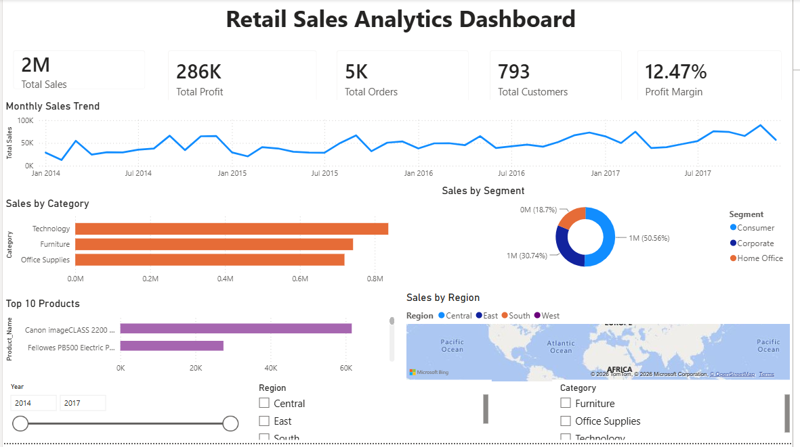

# Retail Sales Analytics Dashboard

An interactive Business Intelligence dashboard built using **Power BI, Power Query, DAX, and Microsoft Excel** to analyze retail sales performance, customer behavior, product profitability, and regional sales trends.

---

## Project Overview

The Retail Sales Analytics Dashboard was developed to help business stakeholders monitor key performance indicators (KPIs), identify sales trends, evaluate product performance, and generate actionable insights for informed decision-making.

The dashboard transforms raw retail transaction data into interactive visualizations that provide a clear understanding of sales performance across products, customer segments, and regions. It enables users to explore business performance through dynamic reports and interactive filters.

---

## Business Problem

Retail businesses generate large volumes of transaction data every day, making it challenging to identify meaningful insights from raw datasets.

The organization needed a centralized reporting solution to answer key business questions such as:

- What is the total sales revenue?
- How much profit has been generated?
- Which products generate the highest sales?
- Which customer segments contribute the most revenue?
- Which regions perform the best?
- How do sales trends change over time?
- What is the company's overall profit margin?

This dashboard provides an interactive platform that answers these questions and supports data-driven decision-making.

---

## Project Objectives

The primary objectives of this project are:

- Analyze retail sales performance
- Monitor key business KPIs
- Track monthly sales trends
- Identify top-performing products
- Compare regional sales performance
- Analyze customer segments
- Enable interactive filtering for business users
- Support strategic business decisions with actionable insights

---

## Technology Stack

| Tool | Purpose |
|------|----------|
| Power BI | Dashboard Development |
| Power Query | Data Cleaning and Transformation |
| DAX | KPI and Business Metric Calculations |
| Microsoft Excel | Dataset Storage and Initial Data Preparation |

---

## Dataset Information

**Dataset:** Sample Superstore

The dataset contains retail transaction information, including:

- Order Details
- Customer Information
- Product Details
- Sales
- Profit
- Quantity
- Discount
- Shipping Details
- Region
- State

### Dataset Columns

- Row ID
- Order ID
- Order Date
- Ship Date
- Ship Mode
- Customer ID
- Customer Name
- Segment
- Country
- City
- State
- Postal Code
- Region
- Product ID
- Category
- Sub Category
- Product Name
- Sales
- Quantity
- Discount
- Profit

---

## Data Preparation

The dataset was cleaned and transformed using **Power Query** before building the dashboard.

### Data Cleaning Steps

- Removed duplicate records
- Checked for missing values
- Corrected data types
- Converted date columns to Date format
- Standardized text values
- Created additional analytical columns:
  - Year
  - Month Number
  - Month Name
  - Quarter
  - Day Name

---

## Key Performance Indicators (KPIs)

The dashboard tracks the following metrics:

- Total Sales
- Total Profit
- Total Orders
- Total Customers
- Profit Margin

---

## DAX Measures

### Total Sales

```DAX
Total Sales =
SUM(Sheet1[Sales])
```

### Total Profit

```DAX
Total Profit =
SUM(Sheet1[Profit])
```

### Total Orders

```DAX
Total Orders =
DISTINCTCOUNT(Sheet1[Order_ID])
```

### Total Customers

```DAX
Total Customers =
DISTINCTCOUNT(Sheet1[Customer_ID])
```

### Profit Margin

```DAX
Profit Margin =
DIVIDE([Total Profit], [Total Sales])
```

---

## Dashboard Visualizations

### KPI Cards

- Total Sales
- Total Profit
- Total Orders
- Total Customers
- Profit Margin

### Monthly Sales Trend

**Visualization:** Line Chart

Displays monthly sales performance to identify growth patterns and seasonal trends.

### Sales by Category

**Visualization:** Clustered Bar Chart

Compares sales performance across different product categories.

### Sales by Customer Segment

**Visualization:** Donut Chart

Shows the revenue contribution of each customer segment.

### Sales by Region

**Visualization:** Bar Chart

Compares sales performance across different geographical regions.

### Top Performing Products

**Visualization:** Bar Chart

Highlights products generating the highest sales revenue.

---

## Interactive Filters

Users can filter the dashboard using:

- Year
- Region
- Category

These filters allow users to analyze business performance from multiple perspectives.

---

## Dashboard Preview

> Add your dashboard screenshot here.

Example:

```text
Images/
└── dashboard.png
```

Then include:

```markdown

```

---

## Project Structure

```text
Retail-Sales-Analytics-Dashboard
│
├── Dashboard
│   └── Retail Sales Analytics Dashboard.pbix
│
├── Dataset
│   └── Sample - Superstore.xlsx
│
├── Images
│   └── dashboard.png
│
├── README.md
│
└── LICENSE
```

---

## Future Enhancements

Potential improvements for future versions include:

- Drill-through reports
- Customer Lifetime Value (CLV) Analysis
- Sales Forecasting
- Profit Forecasting
- Inventory Analysis
- Dynamic Report Tooltips
- Mobile-Optimized Dashboard
- Power BI Service Deployment
- Automated Data Refresh

---

## Key Learnings

This project provided practical experience in:

- Business Intelligence
- Data Cleaning
- Data Transformation
- Power BI Dashboard Development
- DAX Calculations
- KPI Development
- Data Visualization
- Business Storytelling
- Interactive Report Design

---

## Skills Demonstrated

- Microsoft Power BI
- Power Query
- DAX
- Data Cleaning
- Data Transformation
- Data Visualization
- Business Analytics
- Dashboard Design
- KPI Development
- Retail Sales Analysis

---

## Author

**Sathwik Reddy**

If you found this project useful, consider giving it a ⭐ on GitHub.